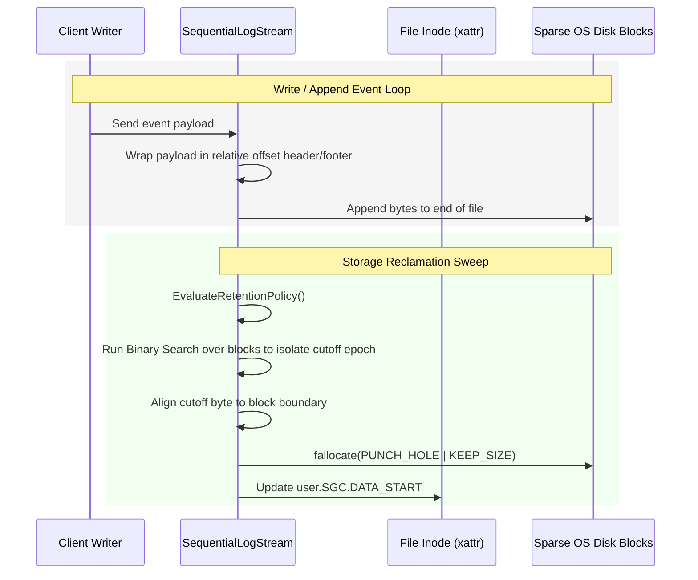

# Reference Spec: Sequential Edge Stream Storage (decoupled)

* **Original System Reference:** Sequential file-buffered edge stream log (`flowfile.py`)
* **Reference Output Location:** `reference/sequential_storage.md`
* **Target Environment & Operating System Capabilities:** Linux POSIX filesystem, Extended Inode Attributes (`xattr`), and sparse file punch-hole operations (`fallocate`).

---

## 1. Core Systemic Intent
The **Sequential Edge Stream Storage** module acts as a high-performance, edge-native telemetry buffer. To operate reliably on resource-constrained physical IoT gateways, it avoids database server locking and writing amplification (which wears down flash memory). It implements an append-only flat-file sequential event buffer utilizing direct filesystem-level capabilities:
1. **In-File Bidirectional Offsets:** Allows traversing millions of events forward or backward in sub-milliseconds without full-file parses.
2. **Metadata Binding via extended attributes (`xattr`):** Keeps stream properties (pointers, offsets, and GC limits) bound directly to the file inode, avoiding sidecar configuration files.
3. **Storage Reclamation via Hole Punching (`fallocate`):** Instantly deallocates obsolete historical storage blocks from the front of the file without shifting data or rewriting the active stream.

---

## 2. Core Capabilities
- **Direct Stream Appends:** Serializes and appends event packages to a binary file wrapped in look-ahead and look-behind relative byte offsets.
- **Dynamic File Inode Configurations:** Loads and hot-reloads size limits, age limits, and current active read pointers directly from extended filesystem attributes.
- **Block-Aligned Sparse Reclamation:** Automatically punches holes in the leading sections of the file to free physical disk sectors once capacity thresholds are breached.
- **Time-Based Log Purging:** Traverses the physical file structure using a block-aligned binary search to find the byte offset corresponding to a cutoff timestamp, then truncates all prior blocks.

---

## 3. Abstract Logical Interfaces & APIs

### Conceptual Class: `SequentialLogStream`
An active instance manages a single physical stream file.

* **Stream State Attributes (Abstract):**
  * `PhysicalFilePath`: Path to the storage log on disk.
  * `IoBlockSize`: The filesystem's physical block size in bytes (obtained via `fstat` of the open descriptor).
  * `StreamStartByteOffset`: The absolute byte position where the oldest active, non-deallocated record begins.
  * `StreamCapacityThresholdBlocks`: Size limit of the stream in physical blocks.
  * `RecordAgeLimitMinutes`: Time window (in minutes) for retaining historical events.
  * `TrimmingSafetyHeadroomBlocks`: Headroom blocks to exceed before size-based reclamation triggers.

---

* **Abstract Operations:**

  * `Operation: InitializeStream(filePath: string, configurationOverrides: map) -> void`
    * **Description:** Opens or creates the target binary file. Queries and stores the local filesystem's logical I/O block size. Synchronizes and reads extended attributes from the file's inode, falling back to configuration overrides if attributes are absent. Discovers the current active stream head offset.
    * **Side Effects:** Recursively creates parent directories if missing; opens a file descriptor in read/write/append binary mode.

  * `Operation: SynchronizeMetadata() -> void`
    * **Description:** Hot-reloads operational limits and garbage collection parameters in real-time from the filesystem extended attributes.
    * **Purpose:** Allows administrators to tune parameters live using command-line attribute editors without disrupting ingestion.

  * `Operation: LocateNextRecordBoundary(startOffset: int) -> int`
    * **Description:** Sweeps forward from `startOffset` in block-size increments using look-ahead scanning to identify the signature of the next valid serialized event package.
    * **Purpose:** Safely navigates over deallocated "holes" (null-byte sparse sections) left by storage reclamation.
    * **Returns:** The absolute byte offset of the next valid event package.

  * `Operation: EvaluateRetentionPolicy() -> void`
    * **Description:** Initiates standard garbage collection checks:
      1. **Size-based:** Queries current physical blocks. If they exceed the configured limits plus headroom, calculates the bytes to prune and triggers storage deallocation.
      2. **Time-based:** Compares oldest record timestamps using a binary-search cutoff discovery. If the oldest records are out of bounds, calculates the cutoff offset and triggers storage deallocation.

  * `Operation: PunchHoleAtStreamHead(targetPruneBytes: int) -> int`
    * **Description:** Truncates leading space up to a safe record boundary:
      1. Finds the next record boundary at or after the requested prune threshold using `LocateNextRecordBoundary`.
      2. Aligns the deallocation boundary *backwards* to the nearest physical block size (prerequisite for kernel-level hole punching).
      3. Invokes the OS-level `fallocate` with `FALLOC_FL_PUNCH_HOLE | FALLOC_FL_KEEP_SIZE` to zero-out physical disk blocks.
      4. Updates the `StreamStartByteOffset` and commits the new starting byte position to the file inode.
    * **Returns:** The OS status code of the hole punch system call.

  * `Operation: SeekThroughStream(timeCutoff: timestamp, eventCount: int, byteCount: int, seekDirection: Enum[Forward, Backward]) -> (int, int)`
    * **Description:** Traverses the stream linearly using relative packet offset headers until a threshold condition (time, event count, or byte size) is achieved.
    * **Returns:** Tuple containing the number of events traversed and the final absolute byte offset.

---

## 4. Concept Data Formats & Metadata State

### Inode Extended Metadata (xattr)
Bound directly to the ext4/xfs inode to track runtime state:
* `user.SGC.DATA_START` (Logical: Stream Start Byte Offset): Points to the absolute file index where the first non-deallocated record begins.
* `user.SGC.MAX_BLOCKS` (Logical: Stream Capacity Limit): The maximum number of physical blocks allowed before size-based GC triggers.
* `user.SGC.MAX_AGE_MIN` (Logical: Record Age Limit): Maximum age of records in minutes before time-based GC triggers.
* `user.SGC.SAFETY_HEADROOM` (Logical: Trimming Safety Headroom): Extra block buffer allocated before purging starts.
* `user.SGC.POLL_DELAY_SEC` (Logical: GC Poll Interval): Sleep time between daemon sweeps.

### Serialized Package Format (Decoupled & Succinct Schema)
Each record appended to the stream is enclosed in a layout that supports relative seeking in both directions with minimal payload overhead:
```json
{
  "nxt": 164,
  "ts": "2026-05-25 12:44:00.123456",
  "src": "127.0.0.1:2000",
  "data": { ... },
  "prv": 164
}
```
* **`nxt`**: The exact byte offset from the start of the current record to the start of the next record. Placed at the very front of the JSON sequence for look-ahead reads.
* **`prv`**: The exact byte offset of the current record. Placed at the very end of the JSON sequence to permit look-behind reads.
* **`ts`**: Succinct UTC Timestamp string (or unix epoch number) representing event generation time.
* **`src`**: Succinct origin source node or sender identifier.
* **`data`**: Succinct nested object containing the core telemetry payload.

---

## 5. Architectural Interactions & Lifecycles



---

## 6. Mathematical & Systemic Algorithms

### 1. $O(\log N)$ Time-Based Cutoff Discovery via Binary Search
To avoid loading or reading a multi-gigabyte log sequentially, the system isolates age-violating boundaries using a binary search over physical file blocks:
1. Initialize search range: `low = StreamStartByteOffset`, `high = file_size`.
2. Compute the mid-point byte offset: `mid = (low + high) // 2`.
3. Align the offset backwards to the hardware sector size: `mid = (mid // IoBlockSize) * IoBlockSize`.
4. Call `LocateNextRecordBoundary(mid)` to find the start of the next valid packet.
5. Seek to this offset, read a small peek window, and extract the `ts` parameter (timestamp) of the packet.
6. Convert the timestamp to epoch seconds.
7. Compare with target time cutoff:
   * If the record is older than the target time window, it is a candidate for deletion. Update candidate boundary and shift search range: `low = mid + IoBlockSize`.
   * If the record is within the valid time window, contract the search range: `high = mid`.

### 2. Block-Aligned Kernel Deallocation (Hole Punching)
Linux `fallocate` requires strictly aligned block boundaries:
1. Find the remainder block offset: `block_offset = StreamStartByteOffset % IoBlockSize`.
2. Align the hole start index backwards to the block edge: `hole_start = StreamStartByteOffset - block_offset`.
3. Locate the target safe record boundary end (`hole_end`) beyond the required trim size.
4. Issue system call:
   ```bash
   fallocate(fd, FALLOC_FL_PUNCH_HOLE | FALLOC_FL_KEEP_SIZE, hole_start, hole_end - hole_start)
   ```
5. Commit the new stream start state (`StreamStartByteOffset = hole_end`) to inode extended attributes (`user.SGC.DATA_START`).
